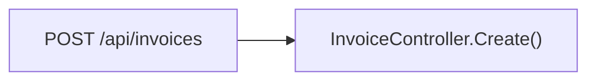
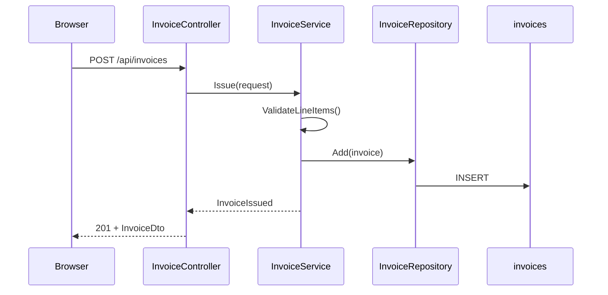
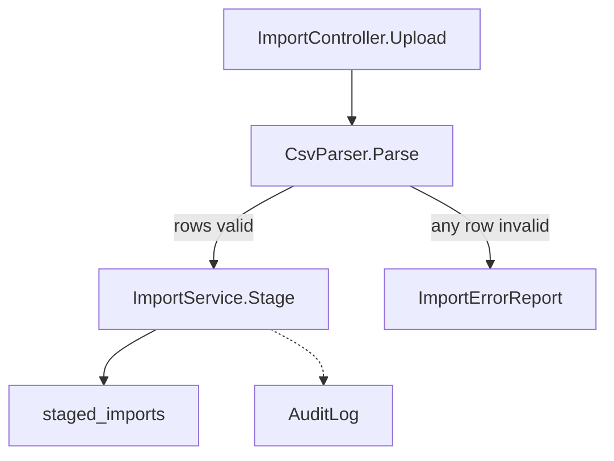
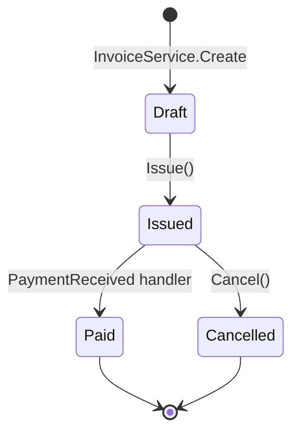

# Drawing the flow

Read during step 6. One diagram per map, of the spine that was actually read.
This file decides which kind to draw and what a node is allowed to say.

## Contents

- [Choosing the kind](#choosing-the-kind)
- [The node rule](#the-node-rule)
- [Size](#size)
- [Drawing boundaries](#drawing-boundaries)
- [Labels that break mermaid](#labels-that-break-mermaid)
- [Sequence example](#sequence-example)
- [Flowchart example](#flowchart-example)
- [State example](#state-example)
- [What not to draw](#what-not-to-draw)
- [Checking it](#checking-it)

## Choosing the kind

| The feature is | Draw | Because |
| :--- | :--- | :--- |
| a request and its response | `sequenceDiagram` | the interesting part is who calls whom, in order, and what comes back |
| a pipeline that branches or retries | `flowchart` | the interesting part is the conditions, and a sequence diagram hides them |
| something with a lifecycle | `stateDiagram-v2` | the interesting part is which transitions exist, not which function runs |

When two fit, draw the one whose interesting part matches what the reader will
need to change. A CRUD endpoint with a status field is a sequence diagram if
people add fields to it, and a state diagram if people add statuses.

## The node rule

Every node names something that exists in this repo: a route, a type, a method,
a component, a table, a queue, a file. A reader must be able to grep the label
and land somewhere.

No node is a category. `Business Logic`, `Backend`, `Data Layer`, and `Frontend`
are not things in the repo — they are the words used to avoid naming things in
the repo, and a diagram made of them is true of every project ever written.

Where a name is ambiguous on its own, qualify it the way the code does:
`InvoiceService.Issue`, not `Issue`.

## Size

Aim for eight to twelve nodes; stop at about fifteen. A diagram that needs more
is drawing more than the spine — collapse the boundaries into single nodes and
push the detail into the tables, which is where paths and line numbers belong.

A three-node diagram is a fine outcome for a small feature. Padding it to look
substantial makes it wrong.

## Drawing boundaries

Boundaries — the hops that were named but not read — belong in the picture, or
the flow appears to happen in a vacuum. Mark them so the reader knows they were
not followed:

- `flowchart`: a dashed edge, and a node with a `:::boundary` class or a plain
  rectangle where feature nodes are rounded.
- `sequenceDiagram`: a participant with a note reading `boundary — not read`.

The point is that a reader can tell what this map knows from what it merely
touched.

## Labels that break mermaid

Parentheses, quotes, colons, and angle brackets in a label end the parse in ways
that are tedious to debug. Wrap any label carrying them in double quotes:

Generic type parameters (`Repository<Invoice>`) are the most common offender.
Quote them, or write them as `Repository of Invoice`.

## Sequence example

## Flowchart example

The dashed edge to `AuditLog` says it was named, not read.

## State example

## What not to draw

- The layer cake. Three stacked boxes named after tiers describe the industry,
  not the feature.
- The directory tree. A file listing is a table, and it reads better as one.
- Everything that was read. The diagram is the spine; the tables carry the rest.
- Two diagrams. If one picture cannot hold it, the boundary between feature and
  system was drawn in the wrong place — fix that instead.

## Checking it

Before writing the map, walk the diagram once against the notes and confirm
three things: every node label appears in a path the map lists, every edge is a
call or a transition someone actually read, and no node was added because the
picture looked sparse. A node that cannot be traced back to a file is the one
mistake in a map that a reader has no way to catch.
